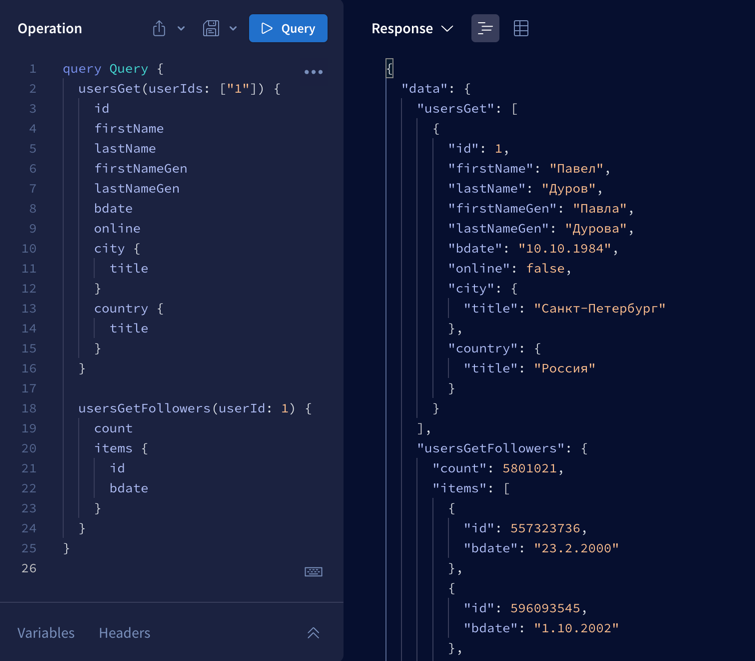

# GraphQL VK API

Это простая _self-hosted_ обертка над VK API. 
Она позволяет делать запросы к VK с помощью GraphQL.

Методов мало. Многие решения сомнительны. В работе.



# Как запустить

```shell
$ npm install
```

```shell
$ npx ts-node generate-typings
```

```shell
$ npm run start:dev
```

# Где смотреть

http://localhost:3000/graphql
